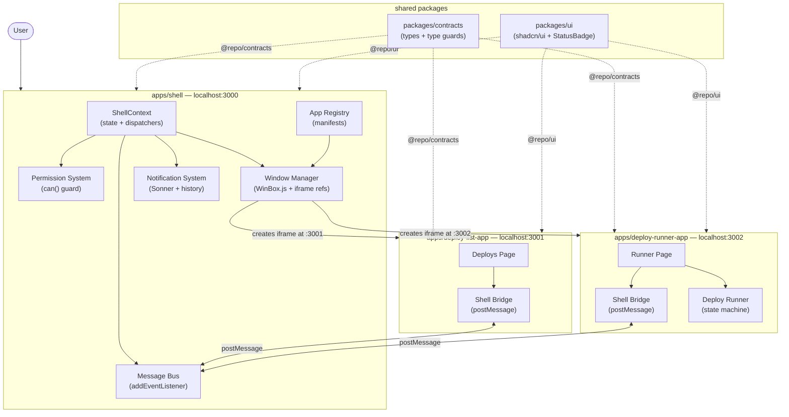
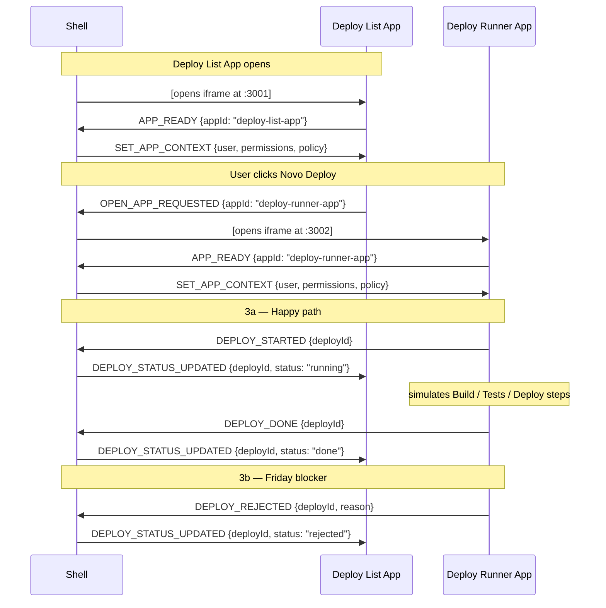
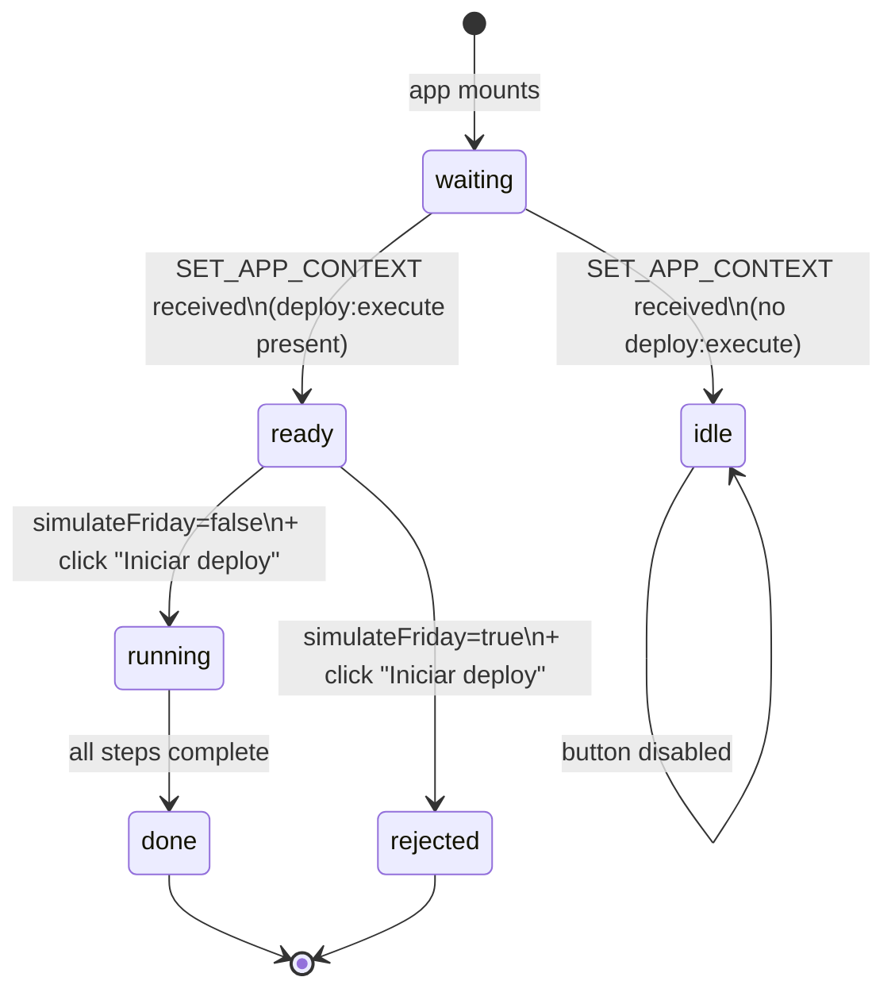

# feat: Build BrowserOS microfrontend demo

## Summary

Build a complete, presentation-ready BrowserOS application: a Turborepo monorepo where a Next.js shell acts as an in-browser OS, opening microfrontend apps (Deploy List App, Deploy Runner App) in WinBox.js floating windows containing iframes, coordinating permissions, state, and communication via `window.postMessage`. The project includes shared TypeScript contracts, a shadcn/ui component library, AI Rules documentation, skill prompts, and a README with demo script — ready to present in a ~50-minute conference talk.

---

## Problem Frame

This is a conference demo that argues microfrontends are valuable beyond the typical e-commerce / domain-team use case. The application must look like a real OS (compelling visuals), behave like a real system (permissions enforced, events flowing), and be explainable in plain language without diving into code. The existing Turborepo scaffold has the skeleton; everything else needs to be built. The project uses pnpm and requires migrating from the current npm workspace setup.

---

## Requirements

### Monorepo foundation

- R1. Monorepo uses pnpm workspaces via `pnpm-workspace.yaml`; `package-lock.json` is removed and replaced by `pnpm-lock.yaml`
- R2. Three apps run on fixed ports: shell (3000), deploy-list-app (3001), deploy-runner-app (3002)
- R3. Four shared packages: `contracts` (types + messages), `ui` (components), `eslint-config`, and `typescript-config`
- R4. Vitest is configured at the workspace level; unit tests cover the permission guard, the Friday blocker logic, the deploy state machine, and key presentational components

### Shell orchestration

- R5. Shell renders a full-screen OS desktop with top bar, app cards, and a dock
- R6. Apps are opened in WinBox.js floating windows containing iframes loaded from environment variable URLs
- R7. Shell maintains a per-app permission map and exposes a `can(appId, permission)` guard
- R8. Shell sends `SET_APP_CONTEXT` to an app's iframe whenever that app sends `APP_READY`
- R9. All inbound `window.postMessage` events are routed through a single message bus in the shell
- R10. A "Simulate Friday" toggle in the shell UI sets `policy.simulateFriday = true` in shell state
- R11. Shell displays global toast notifications (via Sonner) for all deploy lifecycle events
- R12. Dock reflects the currently opened apps in real time

### Communication contracts

- R13. All event type strings are imported from `packages/contracts`; no app hard-codes message strings locally
- R14. Microfrontends communicate exclusively with the shell via `postMessage`; direct app-to-app messaging is architecturally prohibited

### Deploy List App

- R15. Deploy List App shows a mocked list of deploys with status badges
- R16. "Novo Deploy" button sends `OPEN_APP_REQUESTED` to the shell
- R17. App sends `APP_READY` on mount and listens for `DEPLOY_STATUS_UPDATED` to update each row's status in place

### Deploy Runner App

- R18. Deploy Runner App shows a deployment pipeline UI (context card, pipeline steps, log area)
- R19. "Iniciar deploy" button is enabled only when the shell context includes `deploy:execute`
- R20. When `policy.simulateFriday` is `true`, clicking deploy immediately emits `DEPLOY_REJECTED` with the Friday message
- R21. On the happy path, the app emits `DEPLOY_STARTED`, simulates Build/Tests/Deploy steps with visible progress, then emits `DEPLOY_DONE`
- R22. Rejection emits `DEPLOY_REJECTED` with a `reason` string

### Visual design

- R23. Shell visual identity (colors, typography, spacing) is derived from `base_styles/v0-browseros-shell-design/app/globals.css` (OKLch color tokens, Tailwind v4)
- R24. Shared UI components (Button, Badge, Card, StatusBadge, PermissionBadge) live in `packages/ui`
- R25. Microfrontend apps use `packages/ui` components; shell-specific chrome components stay in `apps/shell`

### Documentation and demo prep

- R26. `AI_RULES.md` documents architecture constraints for AI-assisted development
- R27. `skills/create-microfrontend.md` and `skills/create-shell-feature.md` provide reusable AI generation prompts
- R28. `README.md` covers setup, ports, communication flow, permissions model, and a demo script
- R29. `.env.example` documents required environment variables

---

## Key Technical Decisions

- **WinBox.js integration strategy**: WinBox is a vanilla JS library incompatible with SSR. Import it dynamically inside a `useEffect` or with `import('winbox')` to prevent Next.js from attempting server-side evaluation. Store WinBox instance references alongside iframe refs in shell state so the message bus can target specific windows.

- **Shell state: React Context, not Zustand**: For a demo with two child apps and a single shell, React `useState` + `useContext` is sufficient. A top-level `ShellProvider` holds the full `ShellState` (user, permissions, openedApps, deploys, notifications, policy). Adding Zustand would be premature complexity.

- **postMessage origin handling**: In development, origin validation allowlists `http://localhost:3001` and `http://localhost:3002`. The shell uses `isMicrofrontendMessage()` type guards from `packages/contracts` to parse incoming messages safely. `sendToApp()` calls `iframe.contentWindow.postMessage(msg, targetOrigin)` with the app's known origin.

- **Tailwind v4 adoption**: The `base_styles/` reference uses Tailwind v4 with `@import "tailwindcss"` syntax and OKLch CSS custom properties — adopt verbatim. The v4 PostCSS plugin (`@tailwindcss/postcss`) replaces the v3 CLI. This is a breaking change from v3; do not mix syntaxes across the monorepo.

- **shadcn/ui components: copy from base_styles, not re-scaffold**: The 44 shadcn/ui components in `base_styles/v0-browseros-shell-design/components/ui/` are already configured for this project's design tokens. Copy them into `packages/ui/src/components/` rather than running `npx shadcn init` in the main repo. This preserves the exact component set and avoids reconfiguration.

- **Sonner for global notifications**: `base_styles/` already uses Sonner. Place `<Toaster>` in `apps/shell/app/layout.tsx`. The message bus handler for `PUSH_NOTIFICATION` calls both `toast()` (transient display) and appends to the `notifications` array in ShellState (panel history).

- **Vitest scope for a demo app**: WinBox.js + iframe + postMessage integration requires a real browser and is disproportionate to test headlessly for a demo. Vitest covers: `packages/contracts` type guard functions, the `can()` permission function, the Friday blocker condition, the deploy state machine transitions, and key presentational components. No E2E suite.

- **pnpm migration path**: Delete `package-lock.json`. Add `pnpm-workspace.yaml` with `packages: ["apps/*", "packages/*"]`. Set `"packageManager": "pnpm@9"` in root `package.json`. Remove the `workspaces` field (npm-specific). Run `pnpm install` to generate `pnpm-lock.yaml`. Turborepo delegates to pnpm automatically once `packageManager` is set.

- **Friday toggle and context re-delivery**: `SET_APP_CONTEXT` is triggered by `APP_READY` (sent on mount). If the user toggles Friday mode while Deploy Runner is already open, the updated policy reaches the app only on next open. This is the intended UX for the demo: toggle first, then open a new deploy.

---

## High-Level Technical Design

### Component topology



### postMessage protocol



### Deploy Runner state machine



---

## Output Structure

```
browser_os/
├── apps/
│   ├── shell/                          (existing — rebuilt)
│   ├── deploy-list-app/                (new)
│   └── deploy-runner-app/              (new)
├── packages/
│   ├── contracts/                      (new)
│   ├── ui/                             (existing — expanded)
│   ├── eslint-config/                  (existing — unchanged)
│   └── typescript-config/              (existing — unchanged)
├── base_styles/
│   └── v0-browseros-shell-design/      (visual reference — not built/deployed)
├── skills/
│   ├── create-microfrontend.md         (new)
│   └── create-shell-feature.md         (new)
├── AI_RULES.md                         (new)
├── pnpm-workspace.yaml                 (new)
├── .env.example                        (new)
├── vitest.workspace.ts                 (new)
└── README.md                           (new)
```

---

## Scope Boundaries

### In scope
All 29 steps from the implementation plan: monorepo migration, three apps, shared packages, WinBox.js windows, postMessage bus, permission system, deploy simulation, Friday blocker, notifications, Vitest for pure logic and components, AI Rules, Skills, README, and presentation fallback checklist.

### Not in scope / never in MVP
- Backend, database, or real authentication
- Module Federation or single-spa
- Real iframe sandbox security (CSP hardening)
- Direct microfrontend-to-microfrontend communication
- E2E test suite (Playwright/Cypress)

### Deferred to follow-up work
- Additional microfrontend apps beyond the two deploy apps
- Persistent state (localStorage / URL params)
- Accessibility audit
- CI/CD pipeline
- `packages/config` as an umbrella package — existing `eslint-config` and `typescript-config` packages remain separate; a Tailwind config sharing story is deferred until more than one app needs identical Tailwind configs

---

## Implementation Units

### Phase 1 — Monorepo Foundation

### U1. pnpm migration + scaffold cleanup

**Goal:** Migrate from npm workspaces to pnpm and remove the unused default Turborepo scaffold apps (`apps/web`, `apps/docs`).

**Requirements:** R1

**Dependencies:** none

**Files:**
- `pnpm-workspace.yaml` (create)
- `package.json` (modify — add `"packageManager": "pnpm@9"`, remove `workspaces` field)
- `package-lock.json` (delete)
- `apps/web/` (delete)
- `apps/docs/` (delete)
- `turbo.json` (verify tasks are still correct after removal)

**Approach:** Add `pnpm-workspace.yaml` declaring `packages: ["apps/*", "packages/*"]`. Set `"packageManager": "pnpm@9"` in root `package.json` and remove the `workspaces` array (npm-specific). Delete `package-lock.json`. Delete `apps/web/` and `apps/docs/`. Run `pnpm install` to generate `pnpm-lock.yaml`. Verify `pnpm dev` starts the remaining apps.

**Test scenarios:**
Test expectation: none — pure config; verification is `pnpm install` and `pnpm dev` succeeding.

**Verification:** `pnpm-lock.yaml` exists. `node_modules` resolves correctly. `apps/web/` and `apps/docs/` are gone. `pnpm dev` from the root starts only `apps/shell`.

---

### U2. packages/contracts — shared type system

**Goal:** Create the single source of truth for all message types, permission strings, app IDs, and manifests used across the monorepo.

**Requirements:** R13, R14

**Dependencies:** U1

**Files:**
- `packages/contracts/package.json` (create)
- `packages/contracts/tsconfig.json` (create)
- `packages/contracts/src/index.ts` (create — barrel export)
- `packages/contracts/src/types.ts` (create — `AppId`, `AppPermission`, `DeployStatus`, `User`, `OpenedApp`, `ShellPolicy`)
- `packages/contracts/src/messages.ts` (create — `MicrofrontendMessage`, `ShellMessage` discriminated unions)
- `packages/contracts/src/manifest.ts` (create — `AppManifest` type)
- `packages/contracts/src/guards.ts` (create — `isMicrofrontendMessage()`, `isShellMessage()` runtime type guards)
- `packages/contracts/__tests__/guards.test.ts` (create)

**Approach:** Pure TypeScript package — no React, no build step needed for monorepo-internal consumption (exports via `"exports": {".": "./src/index.ts"}`). `MicrofrontendMessage` and `ShellMessage` are discriminated unions keyed on `type`. Runtime type guards use `typeof data === "object"` + `"type" in data` + union membership checks, enabling both shell and apps to safely parse incoming `postMessage` events without `any` casts.

**Test scenarios:**
- `isMicrofrontendMessage({ type: "APP_READY", payload: { appId: "deploy-list-app" } })` returns `true`
- `isMicrofrontendMessage({ type: "UNKNOWN_EVENT" })` returns `false`
- `isMicrofrontendMessage(null)` returns `false` without throwing
- `isMicrofrontendMessage({ type: "APP_READY" })` (missing payload) returns `false`
- `isShellMessage({ type: "SET_APP_CONTEXT", payload: { appId: "deploy-runner-app", user: {}, permissions: [], policy: {} } })` returns `true`
- TypeScript compilation of a consumer that imports all exported types succeeds without errors

**Verification:** `pnpm --filter @repo/contracts test` passes. All apps can `import type { MicrofrontendMessage } from "@repo/contracts"` without TypeScript errors.

---

### U3. Vitest workspace setup

**Goal:** Configure Vitest across the monorepo at workspace level so unit tests run in any package or app with `pnpm test`.

**Requirements:** R4

**Dependencies:** U1

**Files:**
- `vitest.workspace.ts` (create — root workspace config)
- `packages/contracts/vitest.config.ts` (create — `environment: "node"`)
- `apps/shell/vitest.config.ts` (create — `environment: "jsdom"`)
- `apps/deploy-list-app/vitest.config.ts` (create — `environment: "jsdom"`)
- `apps/deploy-runner-app/vitest.config.ts` (create — `environment: "jsdom"`)
- `package.json` (modify root — add `"test": "turbo run test"`)
- `turbo.json` (modify — add `test` task with `dependsOn: []`, no cache for now)

**Approach:** Root `vitest.workspace.ts` uses `defineWorkspace(["apps/*/vitest.config.ts", "packages/*/vitest.config.ts"])`. App-level configs use `@vitejs/plugin-react` and `environment: "jsdom"`. Contracts config uses `environment: "node"`. Add `vitest`, `@vitest/ui`, `@testing-library/react`, `@testing-library/jest-dom`, `@vitejs/plugin-react` as root devDependencies. Each app's `tsconfig.json` includes `"types": ["vitest/globals"]`.

**Test scenarios:**
Test expectation: none — pure config; verification is test discovery working.

**Verification:** `pnpm test` at root discovers and runs the contracts guard tests from U2. A new test file placed in `apps/shell/src/__tests__/` is also discovered.

---

### U4. packages/ui — Tailwind v4 + shadcn/ui components

**Goal:** Expand `packages/ui` with the full Tailwind v4 design token system and the shadcn/ui components from the `base_styles/` reference.

**Requirements:** R24, R25

**Dependencies:** U1

**Files:**
- `packages/ui/src/globals.css` (create — copied from `base_styles/v0-browseros-shell-design/app/globals.css`)
- `packages/ui/src/lib/utils.ts` (create — `cn()` helper)
- `packages/ui/src/components/` (create — copy 44 shadcn/ui files from `base_styles/.../components/ui/`)
- `packages/ui/src/components/status-badge.tsx` (create — `DeployStatus` → visual variant)
- `packages/ui/src/components/permission-badge.tsx` (create — `AppPermission` → color chip)
- `packages/ui/src/index.ts` (modify — export all components; export globals.css path annotation)
- `packages/ui/package.json` (modify — add `tailwindcss@^4`, `@tailwindcss/postcss`, `lucide-react`, `sonner`, `next-themes`, `class-variance-authority`, `clsx`, `tailwind-merge`)

**Approach:** Copy `globals.css` verbatim — it establishes the OKLch color variable system for the whole monorepo. Copy the 44 shadcn/ui component files unchanged. Add two BrowserOS-specific components: `StatusBadge` maps each `DeployStatus` to a `Badge` variant (`done → success`, `rejected → destructive`, `running → warning`, `pending → secondary`); `PermissionBadge` renders the permission string with color per type. Apps consuming this package import `globals.css` via their own CSS entry point: `@import "@repo/ui/src/globals.css"`.

**Test scenarios:**
- `StatusBadge` with `status="done"` renders with success/green styling
- `StatusBadge` with `status="rejected"` renders with destructive/red styling
- `StatusBadge` with `status="running"` renders with warning/yellow styling
- `StatusBadge` with `status="pending"` renders with secondary/muted styling
- `PermissionBadge` with `permission="deploy:execute"` renders the label text
- `cn("px-2 px-4")` returns `"px-4"` (last-wins Tailwind merge)

**Verification:** TypeScript compilation succeeds across the monorepo. The shell renders with the correct OKLch-based colors when `globals.css` is imported.

---

### Phase 2 — Shell Core

### U5. Shell layout — desktop, top bar, dock

**Goal:** Build the shell's full-screen OS layout adapted from the `base_styles/` components.

**Requirements:** R5, R23

**Dependencies:** U4

**Files:**
- `apps/shell/app/globals.css` (modify — add `@import "@repo/ui/src/globals.css"`)
- `apps/shell/app/layout.tsx` (modify — add `ThemeProvider`, Sonner `<Toaster>`, shell context provider placeholder)
- `apps/shell/app/page.tsx` (replace — BrowserOS desktop page)
- `apps/shell/src/components/top-bar.tsx` (create — adapted from `base_styles/.../top-bar.tsx`)
- `apps/shell/src/components/dock.tsx` (create — adapted from `base_styles/.../dock.tsx`)
- `apps/shell/src/components/desktop-area.tsx` (create — adapted from `base_styles/.../desktop-area.tsx`)
- `apps/shell/src/components/app-card.tsx` (create)
- `apps/shell/package.json` (modify — add `sonner`, `next-themes`, `winbox`, `tailwindcss@^4`, `@tailwindcss/postcss`, `lucide-react`)

**Approach:** Adapt the three `browser-os/` components from `base_styles/` by replacing their internal mock state with props received from the shell context (wired fully in U6). `AppCard` renders one card per manifest entry (icon, name, description) and fires an `onOpen(appId)` callback. TopBar shows user display name, notification bell badge, and a permissions panel toggle. Dock shows an app icon for each opened app entry.

**Patterns to follow:** `base_styles/v0-browseros-shell-design/components/browser-os/top-bar.tsx`, `dock.tsx`, `desktop-area.tsx`

**Test scenarios:**
- `AppCard` renders the app name, icon, and description from a manifest prop
- `AppCard` click fires `onOpen` callback with the correct `appId`
- `Dock` renders the correct count of app entries when passed an `openedApps` array of length 2
- `TopBar` renders the `currentUser.name`

**Verification:** `pnpm --filter shell dev` starts at localhost:3000. Desktop layout with top bar and dock is visible. No crashes on render.

---

### U6. App registry + permission system + shell state

**Goal:** Define the app registry, wire shell state via React Context, and build the permission system with demo toggle controls.

**Requirements:** R6 (manifest read), R7, R10, R12 (dock data source)

**Dependencies:** U2, U5

**Files:**
- `apps/shell/src/features/apps/app-registry.ts` (create)
- `apps/shell/src/features/shell-state/types.ts` (create — `ShellState`, `ShellPolicy`)
- `apps/shell/src/features/shell-state/shell-context.tsx` (create — `ShellContext` + `ShellProvider` + `useShellState`)
- `apps/shell/src/features/permissions/permissions-panel.tsx` (create — adapted from `base_styles/.../permissions-panel.tsx`)
- `apps/shell/src/features/permissions/use-permissions.ts` (create — `can()` hook wrapping shell context)

**Approach:** `appRegistry` is a typed `AppManifest[]` array reading `NEXT_PUBLIC_DEPLOY_LIST_APP_URL` and `NEXT_PUBLIC_DEPLOY_RUNNER_APP_URL` from `process.env`. `ShellState` holds `currentUser`, `permissions` (`Record<AppId, AppPermission[]>`), `openedApps`, `deploys`, `notifications`, and `policy`. `ShellProvider` wraps the shell with all state and dispatchers. The `can(appId, permission)` function reads `permissions[appId]?.includes(permission)`. Permissions panel exposes two demo toggles: "Revogar deploy:execute" (removes from `deploy-runner-app` permissions) and "Simular Sexta-feira" (sets `policy.simulateFriday = true`).

**Patterns to follow:** React `createContext` + `useReducer` or `useState` pattern; `base_styles/.../permissions-panel.tsx`

**Test scenarios:**
- `can("deploy-runner-app", "deploy:execute")` returns `true` with default permissions
- `can("deploy-runner-app", "deploy:execute")` returns `false` after the permission is removed via dispatch
- `can("unknown-app", "deploy:view")` returns `false` without throwing
- Dispatching `toggleFriday` sets `policy.simulateFriday` to `true`
- `appRegistry` contains entries for `deploy-list-app` and `deploy-runner-app` with non-empty `url` values when env vars are set

**Verification:** Permissions panel shows the initial permission list. Toggling "Simular Sexta-feira" changes the button state. The shell context is accessible from any component inside `ShellProvider`.

---

### U7. WinBox.js window manager

**Goal:** Implement the service that opens microfrontend apps in floating WinBox windows containing iframes, and tracks opened apps in shell state.

**Requirements:** R6, R12

**Dependencies:** U5, U6

**Files:**
- `apps/shell/src/features/window-manager/window-manager.ts` (create — imperative WinBox service)
- `apps/shell/src/features/window-manager/use-window-manager.ts` (create — React hook)
- `apps/shell/src/features/window-manager/types.ts` (create — `OpenedAppEntry`)

**Approach:** WinBox must be imported dynamically (no SSR). `openApp(manifest)` checks if the app is already open (dedup by `appId`) — if so, focus the existing window and return. Otherwise: dynamically import `winbox`, create an `<iframe>` element with `src = manifest.url`, create a `WinBox` instance with `manifest.defaultWindowSize`, inject the iframe, store `{ appId, windowId: uniqueId(), iframe, openedAt: Date.now() }` in `openedApps` via shell context dispatch. On WinBox's `onclose` callback, dispatch a remove-from-openedApps action. `closeApp(appId)` calls `winboxInstance.close()`.

**Technical design** (directional):
```
openApp(manifest) {
  1. if openedApps has appId → focus existing, return
  2. const WinBox = await import('winbox')
  3. const iframe = document.createElement('iframe')
     iframe.src = manifest.url
  4. const wb = new WinBox({ title, width, height,
       mount: iframe,
       onclose: () => dispatch(removeApp(appId)) })
  5. dispatch(addApp({ appId, windowId, iframe, openedAt }))
}
```

**Test scenarios:**
- Opening the same `appId` twice does not add a second entry to `openedApps`
- After `openApp()`, `openedApps.length` increases by 1
- After `closeApp(appId)`, the entry is removed from `openedApps`
- `openApp` with a manifest having `defaultWindowSize: { width: 780, height: 520 }` creates a WinBox with those dimensions

**Verification:** Clicking an app card opens a floating WinBox window containing an iframe at the configured URL. The dock updates to show 1 opened app. Closing the window removes the dock entry.

---

### U8. postMessage bus

**Goal:** Centralize all inbound and outbound `window.postMessage` communication in the shell.

**Requirements:** R8, R9, R13, R14

**Dependencies:** U6, U7

**Files:**
- `apps/shell/src/features/message-bus/shell-message-bus.ts` (create — core handler logic)
- `apps/shell/src/features/message-bus/handlers/on-app-ready.ts` (create)
- `apps/shell/src/features/message-bus/handlers/on-open-app-requested.ts` (create)
- `apps/shell/src/features/message-bus/handlers/on-push-notification.ts` (create)
- `apps/shell/src/features/message-bus/handlers/on-deploy-started.ts` (create)
- `apps/shell/src/features/message-bus/handlers/on-deploy-done.ts` (create)
- `apps/shell/src/features/message-bus/handlers/on-deploy-rejected.ts` (create)
- `apps/shell/src/features/message-bus/use-message-bus.ts` (create — registers listener in useEffect)
- `apps/shell/src/features/message-bus/send-to-app.ts` (create — targets a specific iframe)

**Approach:** A single `window.addEventListener("message", handleMessage)` registered in a `useEffect` at the shell root. `handleMessage` validates origin against the allowlist (`localhost:3001`, `localhost:3002`), calls `isMicrofrontendMessage()`, and dispatches to typed handlers. Handlers are plain functions receiving `(message, shellContext)`. Handler responsibilities:
- `onAppReady`: builds `SET_APP_CONTEXT` payload (user, permissions for this appId, policy) and calls `sendToApp`
- `onOpenAppRequested`: validates `can(appId, "deploy:view")` before calling `openApp()`
- `onPushNotification`: calls Sonner `toast()` + appends to notifications state
- `onDeployStarted`: updates deploy status to "running" in state; calls `sendToApp(deploy-list-app, DEPLOY_STATUS_UPDATED)`
- `onDeployDone`: updates to "done"; broadcasts `DEPLOY_STATUS_UPDATED`
- `onDeployRejected`: updates to "rejected"; broadcasts `DEPLOY_STATUS_UPDATED`; calls error toast

**Test scenarios:**
- A message with an unknown origin is ignored and no handler is called
- `onAppReady({ appId: "deploy-runner-app" })` calls `sendToApp` with a `SET_APP_CONTEXT` payload containing `permissions` for `deploy-runner-app`
- `onDeployDone({ deployId: "d-001" })` calls `sendToApp("deploy-list-app", { type: "DEPLOY_STATUS_UPDATED", payload: { deployId: "d-001", status: "done" } })`
- `onPushNotification` invokes `toast()` with the correct title and message from the payload
- `onOpenAppRequested` for an app the user lacks `deploy:view` for does not call `openApp()`

**Verification:** Opening Deploy List App triggers `APP_READY` → `SET_APP_CONTEXT` visible in browser devtools. After a deploy completes, `DEPLOY_STATUS_UPDATED` is visible being posted to the deploy-list-app iframe.

---

### U9. Global notifications

**Goal:** Implement the Sonner toast system and the notifications history panel so any microfrontend can push a global alert.

**Requirements:** R11

**Dependencies:** U8

**Files:**
- `apps/shell/src/features/notifications/notifications-panel.tsx` (create — adapted from `base_styles/.../notifications-panel.tsx`)
- `apps/shell/src/features/notifications/use-notifications.ts` (create — add/dismiss/clearAll dispatchers)

**Approach:** `<Toaster>` is already in `layout.tsx` (from U5). The `onPushNotification` handler in the message bus (U8) calls both `toast()` (transient display) and dispatches `addNotification` to `ShellState.notifications` (panel history). The `NotificationsPanel` slides open from the top bar bell icon, shows the notification history with dismiss controls, and displays a badge for unread count. Notification shape: `{ id, title, message, variant, timestamp }`.

**Patterns to follow:** `base_styles/v0-browseros-shell-design/components/browser-os/notifications-panel.tsx`

**Test scenarios:**
- `addNotification` increases `notifications.length` by 1
- `dismissNotification(id)` removes the matching entry
- A notification with `variant: "success"` renders with a green icon
- A notification with `variant: "error"` renders with a red icon
- The bell badge count matches `notifications.length`

**Verification:** Simulating a `PUSH_NOTIFICATION` from browser devtools console causes a Sonner toast and a new entry in the notifications panel.

---

### Phase 3 — Deploy List App

### U10. Deploy List App — layout and mocked data

**Goal:** Create the Deploy List App as a new Next.js app with a deploy table, status badges, and "Novo Deploy" button.

**Requirements:** R15

**Dependencies:** U4

**Files:**
- `apps/deploy-list-app/package.json` (create — port 3001 in dev script)
- `apps/deploy-list-app/tsconfig.json` (create)
- `apps/deploy-list-app/next.config.js` (create)
- `apps/deploy-list-app/app/globals.css` (create — `@import "@repo/ui/src/globals.css"`)
- `apps/deploy-list-app/app/layout.tsx` (create — minimal, no navigation chrome)
- `apps/deploy-list-app/app/page.tsx` (create)
- `apps/deploy-list-app/src/components/deploy-table.tsx` (create)
- `apps/deploy-list-app/src/data/mock-deploys.ts` (create — 3 deploys, mixed statuses)

**Approach:** Scaffold as a minimal Next.js app. No top navigation — the shell is responsible for global chrome. The page renders a heading ("Deploys"), a "Novo Deploy" button (top right), and a table/list of deploy rows. Each row shows: app name, environment, owner, status badge (`StatusBadge` from `@repo/ui`). Mock data has 3 entries covering `done`, `pending`, and `running` statuses to exercise all badge variants.

**Test scenarios:**
- `DeployTable` renders the expected number of rows from a deploys array prop
- A row with `status="done"` contains a `StatusBadge` in success variant
- A row with `status="pending"` contains a `StatusBadge` in secondary variant
- "Novo Deploy" button is present in the DOM and not disabled

**Verification:** `pnpm --filter deploy-list-app dev` starts at localhost:3001. Deploy table is visible. No shell navigation chrome present.

---

### U11. Deploy List App — postMessage integration

**Goal:** Wire the `APP_READY` send, `SET_APP_CONTEXT` receive, `DEPLOY_STATUS_UPDATED` receive, and `OPEN_APP_REQUESTED` send.

**Requirements:** R16, R17

**Dependencies:** U8, U10

**Files:**
- `apps/deploy-list-app/src/hooks/use-shell-bridge.ts` (create)
- `apps/deploy-list-app/app/page.tsx` (modify — integrate bridge)
- `apps/deploy-list-app/__tests__/page.test.tsx` (create)

**Approach:** `useShellBridge()` hook: on mount sends `APP_READY` via `window.parent.postMessage`. Adds a `message` event listener that calls `isShellMessage()` and dispatches to local handlers. On `SET_APP_CONTEXT`: stores `user`, `permissions`, `policy` in React state (for potential future use). On `DEPLOY_STATUS_UPDATED`: updates the matching deploy row in state by `deployId`. "Novo Deploy" button handler calls `window.parent.postMessage(OPEN_APP_REQUESTED, "*")`.

**Test scenarios:**
- `useShellBridge` sends `APP_READY` on mount (assert via `window.parent.postMessage` spy)
- Receiving `DEPLOY_STATUS_UPDATED { deployId: "deploy-001", status: "done" }` updates the row with that id to `done` status
- Receiving `DEPLOY_STATUS_UPDATED` for an unknown `deployId` does not throw and does not mutate other rows
- Clicking "Novo Deploy" calls `window.parent.postMessage` with `type: "OPEN_APP_REQUESTED"` and `appId: "deploy-runner-app"`

**Verification:** Opening Deploy List App via the shell triggers the `APP_READY` → `SET_APP_CONTEXT` sequence. After a deploy completes end-to-end, the corresponding row badge updates without a full page reload.

---

### Phase 4 — Deploy Runner App

### U12. Deploy Runner App — layout and pipeline UI

**Goal:** Create the Deploy Runner App with context display, permission indicator, pipeline stepper, and log area.

**Requirements:** R18

**Dependencies:** U4

**Files:**
- `apps/deploy-runner-app/package.json` (create — port 3002 in dev script)
- `apps/deploy-runner-app/tsconfig.json` (create)
- `apps/deploy-runner-app/next.config.js` (create)
- `apps/deploy-runner-app/app/globals.css` (create)
- `apps/deploy-runner-app/app/layout.tsx` (create — minimal, no nav)
- `apps/deploy-runner-app/app/page.tsx` (create)
- `apps/deploy-runner-app/src/components/context-card.tsx` (create)
- `apps/deploy-runner-app/src/components/pipeline-steps.tsx` (create)
- `apps/deploy-runner-app/src/components/log-area.tsx` (create)
- `apps/deploy-runner-app/src/types.ts` (create — `RunnerStatus`, `PipelineStep`)

**Approach:** Page layout: context card (user name, permission indicator badge), pipeline stepper (three steps: Build, Tests, Deploy — each showing pending/active/done/error state), log area (scrollable text, auto-scrolls to bottom), and the "Iniciar deploy" button. When no context has arrived yet, the page shows a loading/waiting state. `RunnerStatus` drives step rendering. No shell chrome.

**Test scenarios:**
- `PipelineSteps` renders exactly three steps
- In `idle` state all steps render as pending
- In `running` state with `activeStepIndex = 0`, the Build step renders as active
- In `done` state all steps render as complete
- "Iniciar deploy" is `disabled` when `canDeploy = false`

**Verification:** `pnpm --filter deploy-runner-app dev` starts at localhost:3002. Pipeline UI visible with three steps. Button is disabled by default.

---

### U13. Deploy Runner App — postMessage + deploy simulation + Friday blocker

**Goal:** Wire the handshake, implement the deploy state machine with step simulation, and implement the Friday rejection path.

**Requirements:** R19, R20, R21, R22

**Dependencies:** U8, U12

**Files:**
- `apps/deploy-runner-app/src/hooks/use-shell-bridge.ts` (create)
- `apps/deploy-runner-app/src/hooks/use-deploy-runner.ts` (create — state machine)
- `apps/deploy-runner-app/app/page.tsx` (modify — integrate both hooks)
- `apps/deploy-runner-app/__tests__/use-deploy-runner.test.ts` (create)

**Approach:** `useShellBridge` sends `APP_READY` on mount, listens for `SET_APP_CONTEXT`, and stores `permissions` + `policy` in state. `useDeployRunner(permissions, policy, deployId)` exposes `startDeploy()`, `status`, `activeStepIndex`, and `logs`. `startDeploy()`:
- If `policy.simulateFriday` → emit `DEPLOY_REJECTED` with `"Deploy na sexta-feira detectado. O BrowserOS bloqueou essa tentativa por motivos de paz coletiva."`, set status `rejected`, return immediately
- Otherwise: emit `DEPLOY_STARTED`, iterate through steps with 1200ms simulated delay per step (appending log lines), emit `DEPLOY_DONE`, set status `done`

**Technical design** (directional):
```
startDeploy() {
  if policy.simulateFriday:
    emit DEPLOY_REJECTED { reason: "Deploy na sexta-feira..." }
    setStatus("rejected")
    return
  
  emit DEPLOY_STARTED
  setStatus("running")
  for step of [build, tests, deploy]:
    setActiveStep(step.index)
    appendLog(step.startMessage)
    await delay(1200)
    appendLog(step.doneMessage)
  
  emit DEPLOY_DONE
  setStatus("done")
}
```

**Test scenarios:**
- With `simulateFriday = true`, `startDeploy()` emits `DEPLOY_REJECTED` synchronously without entering `running` state
- The Friday rejection `reason` is exactly `"Deploy na sexta-feira detectado. O BrowserOS bloqueou essa tentativa por motivos de paz coletiva."`
- With `simulateFriday = false` and `deploy:execute` present, `startDeploy()` transitions through `idle → running → done`
- Without `deploy:execute`, the "Iniciar deploy" button is `disabled` and `startDeploy()` is never called
- Log area receives at least 3 new entries after a successful deploy (one per pipeline step)

**Verification:** Opening Deploy Runner via the shell → button enables. Clicking starts visible pipeline progress. With Friday mode toggled in the shell, next open shows an immediately rejected deploy.

---

### Phase 5 — Integration + Polish

### U14. End-to-end wiring + environment variables

**Goal:** Validate and finalize the complete demo flow; configure environment variables.

**Requirements:** R2, R8 (full wiring), R29

**Dependencies:** U9, U11, U13

**Files:**
- `.env.example` (create)
- `apps/shell/.env.local` (create — gitignored)
- `apps/shell/app/page.tsx` (verify — all features wired: registry renders, window manager hooked up, message bus active, notifications wired)
- `apps/shell/app/layout.tsx` (verify — `ShellProvider` + `Toaster` present)

**Approach:** Walk through the full 14-step flow: shell opens → cards appear → Deploy List opens in WinBox iframe → `APP_READY` fires → `SET_APP_CONTEXT` sent → "Novo Deploy" → Deploy Runner opens → context received → button enables → deploy runs → `DEPLOY_DONE` → toast appears → Deploy List row updates. Then verify the Friday path: toggle Friday → click "Novo Deploy" → new Deploy Runner → button click → immediate `DEPLOY_REJECTED` → error toast → Deploy List shows `rejected`. Fix any integration gaps found during this pass.

**Test scenarios:**
- Shell context provider renders without errors and exposes `openedApps`, `permissions`, `notifications`, and `policy` to consumers
- `sendToApp("deploy-list-app", DEPLOY_STATUS_UPDATED)` reaches the deploy-list-app iframe (verify via `window.postMessage` spy in test)

**Verification:** Manually walk: shell starts → cards show → Deploy List iframe loads → `APP_READY` fires → `SET_APP_CONTEXT` received → Novo Deploy opens Runner → context arrives → button enables → happy deploy succeeds → toast appears → list row updates → dock shows open apps → toggle Friday → close Runner → reopen → Friday deploy fails immediately → error toast → list row shows `rejected`.

---

### U15. Visual polish

**Goal:** Refine shell and microfrontend visuals for maximum demo impact.

**Requirements:** R23, R24, R25

**Dependencies:** U14

**Files:**
- `apps/shell/src/components/` (modify — polish top bar prominence, dock clarity, app cards, permissions panel layout)
- `apps/deploy-list-app/src/components/` (modify — polish table, status badge sizes, empty state)
- `apps/deploy-runner-app/src/components/` (modify — polish context card, step animations, log auto-scroll)

**Approach:** Shell should look unmistakably like the "operating system": richer background texture/gradient, clear typographic hierarchy in the top bar, prominent permissions panel that shows the demo toggles clearly. Microfrontend apps should look like polished internal tools: clean tables, clear badge colors, good spacing. They should not visually compete with the shell — no background gradients, no top bar chrome. Add subtle step transition animations in the pipeline stepper to make the deploy simulation visually engaging.

**Test scenarios:**
Test expectation: none — visual polish; verify by inspection.

**Verification:** When shell and a microfrontend window are visible simultaneously, it is immediately clear which is the "OS layer" and which is the "app layer."

---

### Phase 6 — Documentation + Demo Prep

### U16. AI_RULES.md + skills/

**Goal:** Document architecture constraints for AI-assisted development and create two reusable skill prompts.

**Requirements:** R26, R27

**Dependencies:** U14

**Files:**
- `AI_RULES.md` (create)
- `skills/create-microfrontend.md` (create)
- `skills/create-shell-feature.md` (create)

**Approach:** `AI_RULES.md` is a tool-agnostic distillation of the constraints in `.claude/CLAUDE.md`: monorepo layout, shell as orchestrator, no direct microfrontend-to-microfrontend messaging, mandatory `APP_READY` → `SET_APP_CONTEXT` handshake, `packages/contracts` as the only source of message type strings. `create-microfrontend.md` walks through: scaffold at `apps/<name>/`, create manifest and add to registry, implement bridge hook (send `APP_READY`, receive `SET_APP_CONTEXT`), define emitted events, style without shell chrome. `create-shell-feature.md` covers: how to add a new event handler to the message bus, extend permissions, add a shell UI panel.

**Test scenarios:**
Test expectation: none — documentation.

**Verification:** A developer reading `create-microfrontend.md` from scratch can scaffold a third microfrontend that correctly integrates with the shell without breaking any architectural rule.

---

### U17. README + presentation fallback

**Goal:** Write the project README and prepare the presentation safety materials.

**Requirements:** R28, R29 (fallback)

**Dependencies:** U16

**Files:**
- `README.md` (create)
- `docs/demo-checklist.md` (create)

**Approach:** `README.md` sections: project goal, architecture overview (mermaid diagram), stack table, getting started (`pnpm install` + `pnpm dev`), app port table, postMessage event reference, permission model, how to trigger Friday mode, AI Rules and Skills overview, 5-step demo script. `demo-checklist.md`: pre-presentation checklist (repo is on stable branch, all three apps start, env vars set, browser cookies cleared, WinBox windows open correctly, Friday toggle works, screenshots/recording taken as fallback).

**Test scenarios:**
Test expectation: none — documentation.

**Verification:** Following the README from a fresh clone results in a running demo within 5 minutes. Demo checklist covers all failure modes mentioned in the user's "Etapa 27."

---

## Risks & Dependencies

- **WinBox.js + Next.js 16 + React 19 SSR**: WinBox accesses `document` on import; it must be dynamically imported inside `useEffect` or with `next/dynamic`. Verify this works correctly during U7 — it is the highest-risk integration point.
- **Tailwind v4 syntax break**: Tailwind v4 uses `@import "tailwindcss"` and `@theme {}` blocks — incompatible with v3 `@tailwind base/components/utilities` directives. Adopt v4 syntax throughout; do not mix. The PostCSS plugin is `@tailwindcss/postcss`, not `tailwindcss` in the PostCSS config.
- **pnpm peer dep resolution on Next.js 16**: If `pnpm install` produces warnings about peer dependencies, add `"pnpm.overrides"` or `"peerDependencyRules"` to root `package.json` rather than using `--shamefully-hoist`.
- **WinBox `onclose` desync**: If the user closes a WinBox window via the title bar X button, the `onclose` callback must dispatch a state update to remove the entry from `openedApps`. Missing this causes the dock badge count to stay incorrect and `sendToApp()` to attempt posting to a closed iframe.
- **Friday toggle + already-open Deploy Runner**: Policy changes only reach a microfrontend on next `APP_READY` → `SET_APP_CONTEXT` cycle. If Deploy Runner is already open when Friday is toggled, it will not know about the change until the next open. Design the demo flow accordingly: toggle first, then open.

---

## System-Wide Impact

- **pnpm migration** is a one-time breaking change for the developer workflow. All contributors must install pnpm. Document this prominently in the README.
- **`packages/contracts` as the message contract boundary** means any new postMessage event type must be added here first, as a new discriminated union member. Adding event strings in-app and bypassing contracts breaks the type guarantee silently.
- **Tailwind v4 in `packages/ui`** means all consuming apps must use the v4 PostCSS plugin. If a future app is scaffolded with the v3 CLI, it will fail to process the shared `globals.css`.

---

## Open Questions

- **WinBox.js TypeScript types**: WinBox may not ship first-party `.d.ts` types. If `@types/winbox` does not exist on npm, use a local `declare module 'winbox'` shim. Defer until U7.
- **Deploy Runner `deployId` source**: The user's plan has `deploy-list-app` sending `params: { deployId: "deploy-003" }` in `OPEN_APP_REQUESTED`. The shell should forward this to the runner via `SET_APP_CONTEXT` as a `currentDeployId`. The exact field name can be resolved during U13 implementation.
